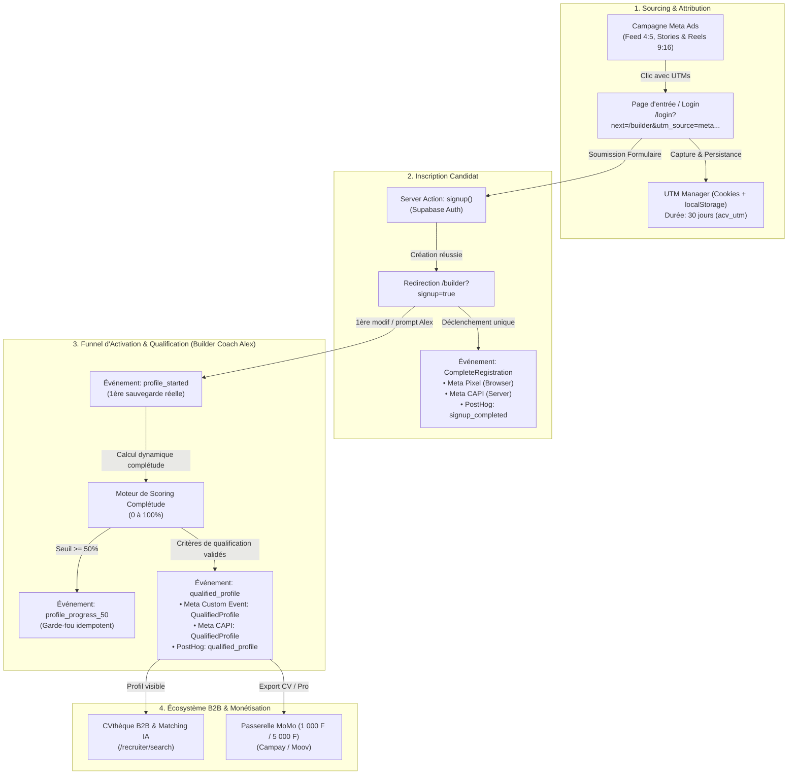

# Plan d'Implémentation : Funnel d'Acquisition Candidat & Tracking Avancé (Meta CAPI + Pixel + PostHog)

> **Projet :** AuthentiCV (Production)  
> **Campagne Cible :** `AUTHENTICV | CANDIDATE ACQUISITION | SIGNAL | CM | V1`  
> **Objectif :** Mesurer et piloter le funnel complet d'acquisition candidat depuis le clic publicitaire jusqu'au profil qualifié exploitable en CVthèque B2B, sans faux positifs ni double-comptage.

---

## 🧭 Architecture Globale & Écosystème



---

## 📦 Inventaire des Fichiers & Dépendances

### Nouveaux Fichiers à Créer :
1. `src/lib/utm.ts` : Capture, stockage persistant (cookie + local storage) et restitution des paramètres UTM.
2. `src/lib/profile-qualification.ts` : Règles métier pures pour `isQualifiedCandidateProfile(cvData)` et calcul de complétude standardisé.
3. `src/app/api/analytics/meta-capi/route.ts` : Route API serveur pour la Meta Conversions API (CAPI) avec déduplication via `event_id` et hashing SHA-256.
4. `tests/unit/profile-qualification.test.ts` : Tests unitaires de la qualification candidat, de la complétude et des règles de non-redéclenchement.
5. `tests/unit/utm.test.ts` : Tests unitaires de capture et persistance des UTMs.

### Fichiers Existants à Enrichir :
1. `src/lib/analytics.ts` : Ajout des événements du funnel (`profile_started`, `profile_progress_50`, `profile_completed`, `qualified_profile`), support du `event_id` dédupliqué et injection automatique des UTMs.
2. `src/components/MetaPixel.tsx` : Initialisation de la capture UTM dès le premier chargement de page.
3. `src/hooks/useSyncCv.ts` : Détection des transitions d'état du CV (1ère modif ➔ 50 % ➔ Qualifié) lors des sauvegardes réussies avec drapeaux d'idempotence.
4. `src/app/builder/page.tsx` : Traitement propre du paramètre `?signup=true` avec `trackEvent("signup_completed")` et nettoyage d'URL.

---

## 🎯 Définition Métier Précise de `QualifiedProfile`

Pour être considéré comme **Profil Qualifié (`QualifiedProfile`)** et avoir une réelle valeur pour les recruteurs en zone CEMAC :
1. **Identité Candidate Validée :** `firstName` et `lastName` non vides + `title` (titre professionnel) renseigné + `email` ou `phone` présent.
2. **Parcours / Réalisations :** Au moins une entrée dans `experiences` (avec entreprise et poste) **OU** au moins une entrée dans `projects` (avec nom de projet).
3. **Compétences Techniques / Métier :** Au moins 3 compétences distinctes dans le tableau `skills`.
4. **Formation / Diplôme :** Au moins une entrée dans `education` (avec établissement et diplôme/filière).

---

## 🛠️ Découpage des Tâches Étape par Étape

### Tâche 1 : Module Métier de Qualification & Complétude (`src/lib/profile-qualification.ts`)
- Implémenter la fonction pure `isQualifiedCandidateProfile(cv: CvData): boolean`.
- Implémenter `computeProfileCompleteness(cv: CvData): { score: number; missing: string[]; isQualified: boolean }`.
- Créer le test unitaire `tests/unit/profile-qualification.test.ts` validant tous les cas limites.

### Tâche 2 : Persistance Universelle des UTMs (`src/lib/utm.ts`)
- Extraire les paramètres `utm_source`, `utm_medium`, `utm_campaign`, `utm_content`, `utm_term`, `fbclid` depuis l'URL courante.
- Sauvegarder dans un cookie `acv_utm` (30 jours, `SameSite=Lax`) et `localStorage`.
- Fournir une fonction `getStoredUtms()` qui injecte automatiquement ces données dans chaque payload analytics.

### Tâche 3 : Route Serveur Meta Conversions API (`/api/analytics/meta-capi`)
- Endpoint POST recevant `eventName`, `eventId`, `eventSourceUrl`, `userData` (email, phone, ip, userAgent) et `customData`.
- Normalisation et hashing SHA-256 des identifiants candidat.
- Appel à l'API Graph Meta `https://graph.facebook.com/v20.0/{PIXEL_ID}/events` avec le bearer token `META_CONVERSIONS_API_TOKEN`.
- Gestion d'erreur silencieuse et non bloquante si le token n'est pas présent (mode dégradé Pixel pur).

### Tâche 4 : Standardisation du Moteur Analytics (`src/lib/analytics.ts`)
- Définition des types d'événements :
  * `signup_started` ➔ Meta: `Lead` (formulaire) / PostHog: `signup_started`
  * `signup_completed` ➔ Meta: `CompleteRegistration` (standard) / PostHog: `signup_completed`
  * `profile_started` ➔ Meta: `CustomEvent: ProfileStarted` / PostHog: `profile_started`
  * `profile_progress_50` ➔ Meta: `CustomEvent: ProfileProgress50` / PostHog: `profile_progress_50`
  * `profile_completed` ➔ Meta: `CustomEvent: ProfileCompleted` / PostHog: `profile_completed`
  * `qualified_profile` ➔ Meta: `CustomEvent: QualifiedProfile` / PostHog: `qualified_profile`
- Génération d'un `eventId` (UUID) unique transmis à la fois au Meta Pixel (`fbq('track', ..., { eventID })`) et à la route CAPI pour déduplication exacte côté Meta.

### Tâche 5 : Instrumentation Idempotente dans le Builder (`src/hooks/useSyncCv.ts`)
- Détection lors du hook `save()` :
  * Si première sauvegarde non vide ➔ `trackEvent("profile_started")` (1 seule fois).
  * Si franchissement 50 % ➔ `trackEvent("profile_progress_50")` (1 seule fois).
  * Si transition `isQualifiedCandidateProfile` vers `true` ➔ `trackEvent("qualified_profile")` (1 seule fois).
- Stockage de l'historique des déclencheurs par `resumeId` dans `sessionStorage`/`localStorage` pour résister aux rechargements et sessions multiples.

### Tâche 6 : Validation, Tests de non-régression & Build Production
- Exécution de la suite de tests unitaires Vitest.
- Validation `npm run build` Turbopack / TypeScript.
- Vérification que la CVthèque recruteur (`/recruiter/search`) et les exports PDF ne sont pas impactés.

---

## 🔒 Variables d'Environnement

| Variable | Emplacement | Utilité |
|---|---|---|
| `NEXT_PUBLIC_META_PIXEL_ID` | Vercel & `.env.local` | ID du Pixel Meta (`1393602539516255`) |
| `META_CONVERSIONS_API_TOKEN` | Vercel (Secret) | Token d'accès système Meta pour l'API Conversions (Optionnel mais recommandé pour CAPI) |
| `NEXT_PUBLIC_POSTHOG_KEY` | Vercel & `.env.local` | Clé publique de suivi produit PostHog |
| `NEXT_PUBLIC_POSTHOG_HOST` | Vercel & `.env.local` | Host de collecte PostHog |

---

## 📊 Matrice des KPIs & Tableaux de Bord

```text
[Ad Impressions] 
       │ 
       ▼ (CTR > 1.5%)
[Landing Page Views]
       │
       ▼ (Signup Start Rate > 40%)
[Signup Started]
       │
       ▼ (Completion Rate > 85%)
[CompleteRegistration] ──► CPA Inscription (Phase 1 Target : < 300 FCFA)
       │
       ▼ (Activation Rate > 70%)
[Profile Started]
       │
       ▼ (Progression Rate > 55%)
[Profile Progress 50%]
       │
       ▼ (Qualification Rate > 45%)
[Qualified Profile] ──► CPA Profil Qualifié (Phase 2 Target : < 700 FCFA)
```
