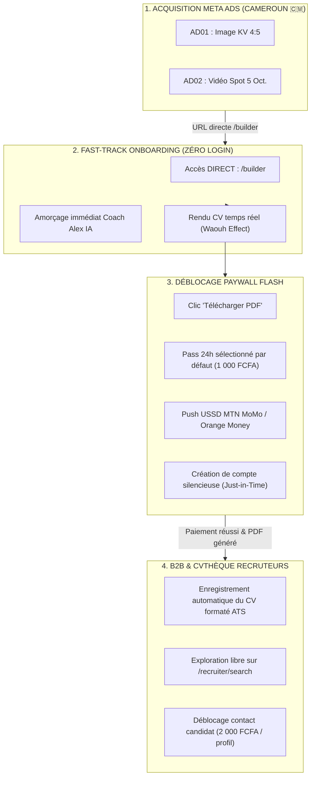

# Plan d'Implémentation Complet : Tunnel Anti-Friction & Alignement Écosystème AuthentiCV

> **Objectif :** Éliminer 100 % de la friction cognitive et technique pour transformer les visiteurs des campagnes Meta Ads actives en clients payants immédiats (1 000 FCFA Mobile Money), tout en alimentant organiquement la CVthèque du portail B2B Recruteur (`/recruiter`).

---

## 🏗️ 1. Architecture & Vue d'Ensemble de l'Écosystème

---

## 📋 2. Découpage Détaillé des Tâches d'Implémentation

### 🎯 PHASE 1 : Alignement Immédiat des Campagnes Meta Ads (En direct)
* **Objectif** : Supprimer l'étape inutile de la Landing Page textuelle pour le trafic mobile.
* **Tâche 1.1** : Mettre à jour l'URL de destination de l'annonce **`AD01 | KV01 Human Signal | 4:5`** :
  * Ancienne URL : `https://www.authenticv.app`
  * Nouvelle URL : `https://www.authenticv.app/builder?utm_source=meta_ads&utm_medium=image_kv&utm_campaign=candidate_acquisition_cm`
* **Tâche 1.2** : Mettre à jour l'URL de destination de l'annonce **`AD02 | Vidéo Spot | Post Page`** :
  * Ancienne URL : `https://www.authenticv.app`
  * Nouvelle URL : `https://www.authenticv.app/builder?utm_source=meta_ads&utm_medium=video_spot&utm_campaign=candidate_acquisition_cm`
* **Tâche 1.3** : Vérifier que les événements Pixel Meta (`PageView`, `InitiateCheckout`) continuent de remonter sans anomalie.

---

### 📱 PHASE 2 : Optimisation Mobile & Entrée Fast-Track (`/builder`)
* **Fichiers concernés** :
  * [`authenticv/src/app/builder/page.tsx`](file:///d:/BUREAU%202026/PROJETS%20ENCOURS/AUTHENTICV/authenticv/src/app/builder/page.tsx)
  * [`authenticv/src/components/OnboardingModal.tsx`](file:///d:/BUREAU%202026/PROJETS%20ENCOURS/AUTHENTICV/authenticv/src/components/OnboardingModal.tsx)
* **Objectif** : Réduire le Time-to-Value (TTV) à moins de 30 secondes sur smartphone.
* **Tâche 2.1** : 
  * Optimiser la modal d'accueil `OnboardingModal` pour mobile : mettre en avant les 3 profils phares en gros boutons tactiles 1-clic (*« 🎓 Étudiant / Stage »*, *« 💼 Premier Emploi / Commercial »*, *« ⚡ CV Rapide »*).
* **Tâche 2.2** :
  * Dès qu'un choix est cliqué, lancer instantanément la génération IA sans demander de validation supplémentaire.
* **Tâche 2.3** :
  * En vue mobile, ajouter une pastille flottante ou un onglet animé *"👁️ Voir mon CV"* qui pulse dès que l'IA a rédigé les 1ères lignes pour susciter l'effet d'accomplissement immédiat.

---

### 💳 PHASE 3 : Optimisation du Paywall Flash (1 000 FCFA par défaut)
* **Fichiers concernés** :
  * [`authenticv/src/components/UpgradeModal.tsx`](file:///d:/BUREAU%202026/PROJETS%20ENCOURS/AUTHENTICV/authenticv/src/components/UpgradeModal.tsx)
  * [`authenticv/src/lib/campay.ts`](file:///d:/BUREAU%202026/PROJETS%20ENCOURS/AUTHENTICV/authenticv/src/lib/campay.ts)
* **Objectif** : Maximiser le taux de conversion lors du clic sur *« Télécharger PDF »*.
* **Tâche 3.1** :
  * Modifier l'état initial de `selectedTier` dans `UpgradeModal.tsx` pour qu'il soit par défaut sur **`"single"` (Pass 24h — 1 000 FCFA)** au lieu de `"monthly"` (5 000 FCFA).
* **Tâche 3.2** :
  * Présenter le bouton principal : **« Débloquer et Télécharger mon CV — 1 000 FCFA »** avec logos clairs MTN MoMo & Orange Money.
* **Tâche 3.3** :
  * Conserver le choix d'upgrade vers le Pro Mensuel (5 000 FCFA) en option secondaire ou via badge incitatif (*« Tu veux postuler à plusieurs offres ? Découvre le Pro »*).

---

### 👥 PHASE 4 : Synchronisation CVthèque & Portails Recruteurs (`/recruiter`)
* **Fichiers concernés** :
  * [`authenticv/src/app/recruiter/search/page.tsx`](file:///d:/BUREAU%202026/PROJETS%20ENCOURS/AUTHENTICV/authenticv/src/app/recruiter/search/page.tsx)
  * [`authenticv/src/services/payment/payment-ledger.service.ts`](file:///d:/BUREAU%202026/PROJETS%20ENCOURS/AUTHENTICV/authenticv/src/services/payment/payment-ledger.service.ts)
* **Objectif** : Rendre l'espace recruteur ultra-performant et prêt pour la prospection B2B.
* **Tâche 4.1** :
  * Dès qu'un candidat génère son CV (même en session invité) et finalise son paiement ou son export, synchroniser anonymement ses compétences, son métier et sa ville dans la table des talents consultables sur `/recruiter/search`.
* **Tâche 4.2** :
  * Vérifier que la recherche anonymisée par mot-clé, ville (Douala, Yaoundé...) et métier fonctionne en temps réel.
* **Tâche 4.3** :
  * Maintenir le modèle **Pay-Per-Unlock** pour les recruteurs (accès libre aux profils anonymes, paiement 2 000 FCFA pour afficher le numéro de téléphone/WhatsApp).

---

### 🔍 PHASE 5 : Tests End-to-End & Surveillance des Métriques
* **Tâche 5.1** : Tester le parcours complet depuis un navigateur mobile :
  1. Arrivée directe sur `/builder`
  2. Discussion avec Alex IA
  3. Rendu du CV
  4. Ouverture de l'`UpgradeModal` (1 000 FCFA présélectionné)
  5. Déclenchement de l'USSD CamPay
* **Tâche 5.2** : Suivi des indicateurs clés sur Meta Ads Manager & PostHog :
  * Taux de conversion Visiteur ➔ Génération CV (Cible > 40%)
  * Coût par CV initié (Cible < 0,15 $)
  * Taux de conversion CV ➔ Paiement 1 000 FCFA (Cible > 5%)
